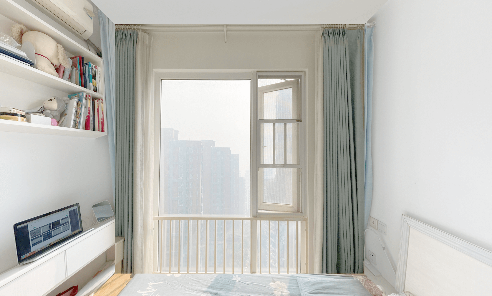
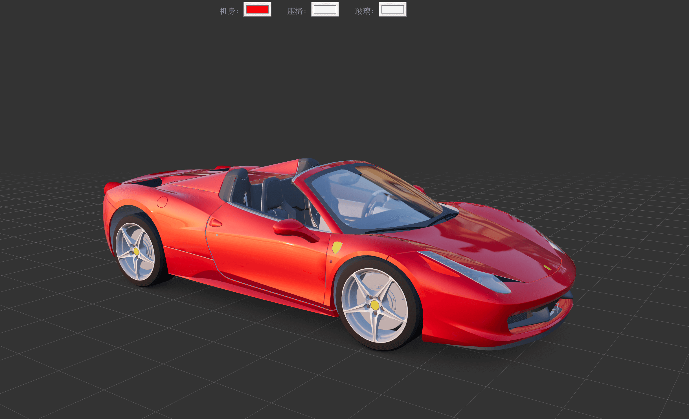

## Three.js 初探

### 简介

Three.js 是一个跨浏览器的脚本，使用 JavaScript 函数库或 API 来在网页浏览器中创建和展示动画的三维计算机图形。Three.js 使用了 WebGL。

WebGL 是一种 JavaScript API，用于在不使用插件的情况下在任何兼容的网页浏览器中呈现交互式2D和3D图形。

> WebGL 1.0 基于 OpenGL ES 2.0，并提供了3D图形的 API。它使用 HTML5 Canvas 并允许利用文档对象模型接口。WebGL 2.0 基于 OpenGL ES 3.0，确保了提供许多选择性的 WebGL 1.0 扩展，并引入新的 API。可利用部分 Javascript 实现自动存储器管理。

目前，WebGL 在最新的浏览器中被广泛支持。然而，其可用性取决于其他因素，如 GPU 支持。

### 特性

- 场景（Scene）：是物体、光源等元素的容器，可在运行时添加和删除对象。
- 相机（Camera）：场景中的相机，代替人眼去观察，场景中只能添加一个，一般常用的是透视相机（PerspectiveCamera）。
- 灯光（Light）：环境、方向、点和点光。
- 材料（Material）：Lambert、Phong、光滑阴影，纹理等。
- 几何（Geometry）：平面，立方体，球体，圆环，3D文本等。
- 物体对象（Mesh）：包括二维物体（点、线、面）、三维物体，模型等等。
- 渲染器（Renderer）：场景的渲染方式，如 webGL \ canvas2D \ Css3D。
- 加载器（Loader）：加载资源。
- 控制器（Control）：轨迹球、FPS、路径等。

[详细文档](https://threejs.org/docs/index.html#manual/en/introduction/)

#### 相机（Camera）

主要有 2 种相机：

- 正交相机 OrthographicCamera
- 透视相机 PerspectiveCamera

THREE.PerspectiveCamera(fov, aspect, near, far);

- fov：摄像机视锥体垂直视野角度，从视图的底部到顶部，以角度来表示。默认值是50。
- aspect：摄像机视锥体的长宽比，通常是使用画布的宽/画布的高。默认值是 1。
- near：摄像机的近端面，默认值是 0.1。
- far：摄像机的远端面，默认值是 2000。

#### 加载器（Loader）

- FileLoader：使用XMLHttpRequest来加载资源的低级类，并由大多数加载器内部使用。
- ImageLoader：用来加载一个Image的加载器。 内部使用FileLoader来加载文件，并被 CubeTextureLoader、ObjectLoader、TextureLoader所使用。

还有其他一些常用文件加载器：如 FBX、Max、OBJ、GLTF等。

### 示例

#### 街道

创建一个街道，键盘控制前进后退。

```javascript
const keyActions = {
  37: (camera) => {
    rotate += stepY;
    camera.rotation.y = rotate;
  },
  38: (camera, pointLight) => {
    cameraStart -= stepZ;
    camera.position.setZ(cameraStart);
    pointLight.position.setZ(cameraStart);
  },
  39: (camera, pointLight) => {
    rotate -= stepY;
    camera.rotation.y = rotate;
    pointLight.rotation.y = rotate;
  },
  40: (camera) => {
    cameraStart += stepZ;
    camera.position.setZ(cameraStart);
  },
};

const createCube = (h, w, d, color) => {
  const cubeGeometry = new THREE.BoxGeometry(h, w, d);
  const cubeMaterial = new THREE.MeshLambertMaterial({color});
  return new THREE.Mesh(cubeGeometry, cubeMaterial);
};

const createStreet = (scene, width) => {
  const street = createCube(width, 1, 10000, 'lightgray');
  street.position.setZ(3200);
  scene.add(street);
};

const createStreetSide = (scene, x) => {
  let cube;
  let z = 0;
  for (let i = 0; i < 200; i++) {
    cube = createCube(100, Math.random() * 500, 100, randItem(colors));
    cube.position.set(x, 0, z);
    scene.add(cube);
    z += 100;
  }
};

```

#### 房间

拍摄上下左右前后六张照片，即可实现 3D 效果。

```javascript
const startScene = (mountDom = document.body) => {
  const {width, height} = getViewportSize();
  const renderer = new THREE.WebGLRenderer({antialias: true});
  const scene = new THREE.Scene();
  const camera = new THREE.PerspectiveCamera(90, width / height, 0.1, 1000);
  const controls = new OrbitControls(camera, renderer.domElement);

  const setConfigs = () => {
    renderer.setPixelRatio(window.devicePixelRatio);
    renderer.setSize(width, height);
    renderer.outputEncoding = THREE.sRGBEncoding;
    mountDom.appendChild(renderer.domElement);

    camera.position.x = -0.1;

    controls.rotateSpeed = -1.0;
    controls.enablePan = false;
    controls.enableDamping = true;
    controls.enableZoom = true;
    controls.maxDistance = 0.5;

    const materialArray = getMaterial(THREE);

    const geometry = new THREE.BoxGeometry(1, 1, 1);
    const mesh = new THREE.Mesh(geometry, materialArray);
    scene.add(mesh);
  };

  const onResize = () => {
    const {width, height} = getViewportSize();
    camera.aspect = width / height;
    camera.updateProjectionMatrix();
    renderer.setSize(width, height);
  };

  const animate = () => {
    requestAnimationFrame(animate);
    controls.update();
    renderer.render(scene, camera);
  };

  const start = () => {
    setConfigs();
    animate();
    window.addEventListener('resize', onResize, false);
    return () => window.removeEventListener('resize', onResize, false);
  };
  return start();
};

```



#### 城市

通过 3D 图片展示城市一角。

```javascript
const setConfigs = () => {
  renderer.setPixelRatio(window.devicePixelRatio);
  renderer.setSize(width, height);
  renderer.outputEncoding = THREE.sRGBEncoding;
  mountDom.appendChild(renderer.domElement);

  camera.position.x = 0.1;

  controls.enablePan = false;
  controls.enableDamping = true;
  controls.enableZoom = true;
  controls.maxDistance = 60;
  controls.rotateSpeed = -1.0;
  controls.autoRotate = true;
  controls.autoRotateSpeed = 0.5;

  const geometry = new THREE.SphereGeometry(600, 100, 100);
  geometry.scale(-1, 1, 1);

  const texture = new THREE.TextureLoader().load(cityImg);
  const material = new THREE.MeshBasicMaterial({map: texture});

  const mesh = new THREE.Mesh(geometry, material);

  scene.add(mesh);
};

```

#### 场景切换

多个场景切换，镜头操作。

操作页面：

```javascript
const Index = props => {
  const mountDom = useRef();
  const onChangeScene = useRef();
  const onChangeZoom = useRef();
  useEffect(() => {
    const {destory, changeScene, changeZoom} = startScene(mountDom.current);
    onChangeScene.current = changeScene;
    onChangeZoom.current = changeZoom;
    return destory;
  }, []);
  return <div className="webgl-house-page">
    <div className="switch-bar">
      <ul>
        <li onClick={e => onChangeScene.current?.(-1)}>
          <i className="ico-left" />
        </li>
        <li onClick={e => onChangeZoom.current(-1)}>
          <i className="ico-minus" />
        </li>
        <li onClick={e => onChangeZoom.current(1)}>
          <i className="ico-plus" />
        </li>
        <li onClick={e => onChangeScene.current(1)}>
          <i className="ico-right" />
        </li>
      </ul>
    </div>
    <div ref={mountDom} />
  </div>;
};

```

场景创建：

```javascript
const changeScene = step => {
  currentScene += step;
  currentScene = currentScene < 0 ? 2 : currentScene > 2 ? 0 : currentScene;
  material.map = new THREE.TextureLoader().load(pics[currentScene]);
};

const changeZoom = step => {
  if (step === 1 && deltaCount < deltaMax) {
    camera.fov = Math.max(10, Math.min(100, camera.fov - deltaMax));
    deltaCount += step;
  }
  if (step === -1 && deltaCount < deltaMax) {
    camera.fov = Math.max(10, Math.min(100, camera.fov + deltaMax));
    deltaCount += step;
  }
  camera.updateProjectionMatrix();
};

const start = () => {
  setConfigs();
  animate();
  window.addEventListener('resize', onResize, false);
  window.addEventListener('mousewheel', onMouseWheel, false);
  window.addEventListener('DOMMouseScroll', onMouseWheel, false);
  return {
    destory: () => {
      window.removeEventListener('resize', onResize, false);
      window.removeEventListener('mousewheel', onMouseWheel, false);
      window.removeEventListener('DOMMouseScroll', onMouseWheel, false);
    },
    changeScene,
    changeZoom,
  };
};

```

#### 汽车

全方位查看汽车，并通过页面操作改变部件颜色。

操作页面：

```javascript
const Index = props => {
  const mountDom = useRef();
  const [areaInfo, setAreaInfo] = useState(areas);
  useEffect(() => {
    return startScene(areaInfo, mountDom.current);
  }, []);
  const changeColor = (type, e) => {
    const item = areaInfo.find(({key}) => key === type);
    item.value = e.target.value;
    item.setColor?.(e.target.value);
    setAreaInfo([...areaInfo]);
  };

  return <div className="webgl-car-page">
    <div className="change-color">
      {
        areaInfo.map(({key, value, label}) => <div key={key} className="color-picker">
          <span>{label}：</span>
          <input type="color" value={value} onChange={e => changeColor(key, e)} />
        </div>)
      }
    </div>
    <div ref={mountDom} />
  </div>;
};

```

场景创建：

```javascript
const setMaterials = () => {
  const bodyMaterial = new THREE.MeshPhysicalMaterial({
    color: 0xff0000,
    metalness: 1.0,
    roughness: 0.5,
    clearcoat: 1.0,
    clearcoatRoughness: 0.03,
    sheen: 0.5,
  });
  const detailsMaterial = new THREE.MeshStandardMaterial({
    color: 0xffffff,
    metalness: 1.0,
    roughness: 0.5,
  });
  const glassMaterial = new THREE.MeshPhysicalMaterial({
    color: 0xffffff,
    metalness: 0.25,
    roughness: 0,
    transmission: 1.0,
  });

  areaInfo[0].setColor = value => bodyMaterial.color.set(value);
  areaInfo[1].setColor = value => detailsMaterial.color.set(value);
  areaInfo[2].setColor = value => glassMaterial.color.set(value);

  const shadow = new THREE.TextureLoader().load(ferrariPng);
  const dracoLoader = new DRACOLoader();
  dracoLoader.setDecoderPath('https://www.gstatic.com/draco/v1/decoders/');
  const loader = new GLTFLoader();
  loader.setDRACOLoader(dracoLoader);
  loader.load(ferrariGlb, gltf => {
    const carModel = gltf.scene.children[0];
    carModel.getObjectByName('body').material = bodyMaterial;
    carModel.getObjectByName('rim_fl').material = detailsMaterial;
    carModel.getObjectByName('rim_fr').material = detailsMaterial;
    carModel.getObjectByName('rim_rr').material = detailsMaterial;
    carModel.getObjectByName('rim_rl').material = detailsMaterial;
    carModel.getObjectByName('trim').material = detailsMaterial;
    carModel.getObjectByName('glass').material = glassMaterial;
    wheels.push(
      carModel.getObjectByName('wheel_fl'),
      carModel.getObjectByName('wheel_fr'),
      carModel.getObjectByName('wheel_rl'),
      carModel.getObjectByName('wheel_rr'),
    );
    const mesh = new THREE.Mesh(
      new THREE.PlaneGeometry(0.655 * 4, 1.3 * 4),
      new THREE.MeshBasicMaterial({
        map: shadow,
        blending: THREE.MultiplyBlending,
        toneMapped: false,
        transparent: true,
      }),
    );
    mesh.rotation.x = - Math.PI / 2;
    mesh.renderOrder = 2;
    carModel.add(mesh);
    scene.add(carModel);
  });
};

```



### 总结

总体来说，three.js 上手是比较容易的，如果了解一些几何知识、了解一点 3D 美术知识，那就更好了。

未来应该会有很多 3D 展示需求，该领域的技术也会越来越完善。我觉得这一块主要难点在建模上，模型建好了，怎样去展示与交互，这些都很好实现。

[demo 地址](https://github.com/ahyiru/scenes)
